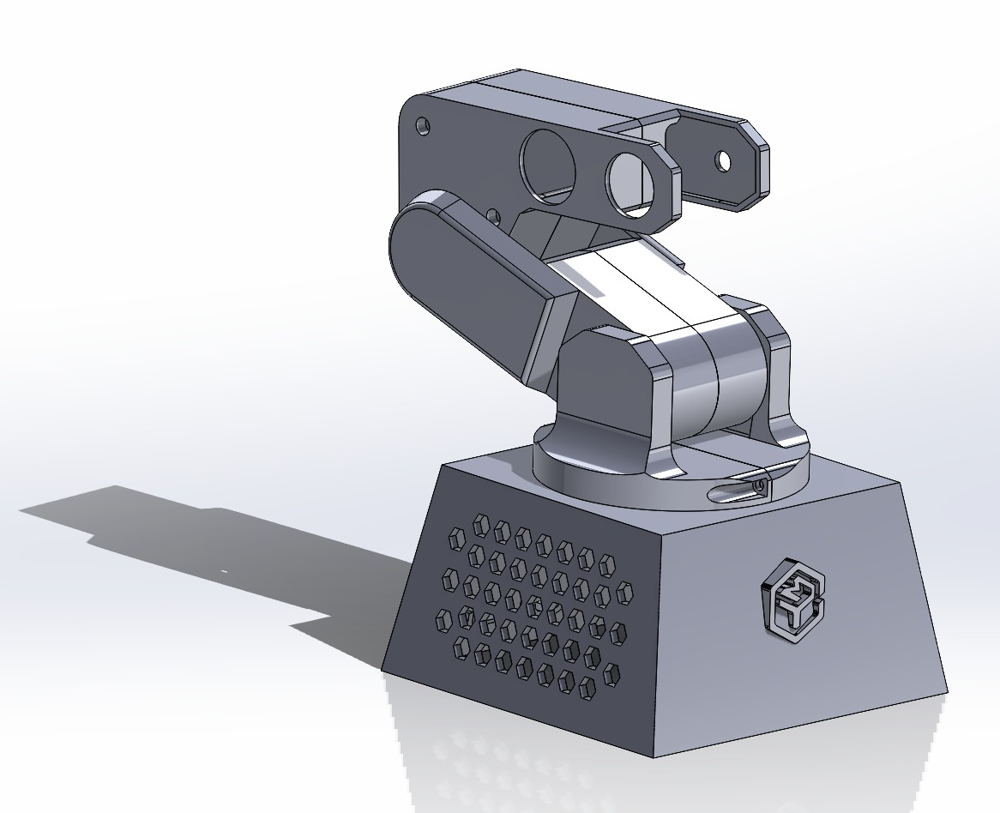

# Robot Macro RB001: Industrial-Grade Mimic/Macro Robotic System

The **Robot Macro RB001** is an ultra-intuitive, 4-DOF robotic manipulator featuring a proprietary hardware-software ecosystem for real-time trajectory recording and zero-learning-curve playback. Designed for seamless human-robot interaction (HRI).

> [!IMPORTANT]
> **Intellectual Property & Proprietary Notice:**
> *This repository serves exclusively as an architectural portfolio and design case study. All production source code (ESP32 firmware pipeline and Visual C# desktop application) as well as manufacturing-grade CAD assemblies are proprietary and confidential to protect commercial distribution rights.*

---

## Hardware Design & 3D Topology

Below is the production-ready structural architecture of the **Robot Macro RB001** platform, featuring integrated high-convection ventilation geometry and dual-lug parallel wrist interfaces.

<p align="center">
  
</p>

---

## System Innovation & Key Features

* **Zero-Learning-Curve HRI:** Kinesthetic teaching interface allowing operators to program complex industrial routines instantly on the RB001 without writing a single line of code.
* **Deterministic Real-Time Logging:** Microsecond-accurate telemetry pairing that registers spatial positions with precise timestamps for high-fidelity macro replication.
* **Production-Proven Reliability:** Deployed under intensive, unstructured academic environments with a 100% operational uptime record.
* **Optimized Thermal Management:** Base chassis engineered with integrated hexagonal ventilation arrays to ensure continuous convection cooling for internal components.

---

## System Topology & Data Pipeline

The RB001 platform relies on an asynchronous data transmission pipeline to decouple low-level embedded hardware tasks from high-level user interface processes:

```mermaid
graph LR
    A[Master Guidance Interface] -->|Analog Telemetry| B(ESP32 / Signal Conditioning)
    B -->|High-Speed UART via USB-C| C(Desktop Application - Visual C#)
    C -->|Serialization & Timestamping| D[Macro Database / File System]
    D -->|Playback Control Mode| B
    B -->|Deterministic Actuation| E[Robot Macro RB001]

    style B fill:#1a365d,stroke:#2b6cb0,stroke-width:2px,color:#fff
    style C fill:#2d3748,stroke:#4a5568,stroke-width:2px,color:#fff
    style E fill:#2f855a,stroke:#48bb78,stroke-width:2px,color:#fff
  ```
  
1. Signal Conditioning Methodology (Embedded Firmware)
To prevent servomotor jitter during manual teaching operations, the system filters high-frequency analog noise natively at the microcontroller layer. It utilizes a discrete Exponential Smoothing Filter (Alpha Filter) processed asynchronously through non-blocking timing barriers (millis() architecture), avoiding execution stagnation in the main control loop.

2. High-Throughput Ingestion (Desktop Bridge)
The application architecture, built on .NET / Visual C#, handles massive serial streams using event-driven communication hooks (DataReceived asynchronous delegates). This keeps the main UI thread decoupled and fluid while incoming state vectors are parsed and timestamped in real time.

Mechanical Evolution: Gripper V2 Redesign
To eliminate structural slippage and torque losses caused by previous compliant-band friction techniques, the Robot Macro RB001 end-effecter has been upgraded to a rigid, synchronous dual-gear mechanical clevis.

```mermaid
graph TD
    subgraph Wrist_Structure [RB001 Rigid Wrist Clevis]
        Servo[Gripper Micro Servo] --- PinA((Pivot Pin A))
        Servo --- PinB((Pivot Pin B))
    end

    subgraph Synchronous_Jaws [Dual-Gear Interlocking Mechanism]
        PinA ===> GearA[Master Jaw / Integrated Gear Sector]
        PinB ===> GearB[Slave Jaw / Integrated Gear Sector]
        GearA <--> |Synchronous Mesh 1:1| GearB
    end

    subgraph Contact_Surfaces [High-Friction Interface]
        GearA --> TipA[Replaceable Compliant Pad]
        GearB --> TipB[Replaceable Compliant Pad]
    end

    style Servo fill:#2d3748,stroke:#4a5568,stroke-width:2px,color:#fff
    style GearA fill:#1a365d,stroke:#2b6cb0,stroke-width:2px,color:#fff
    style GearB fill:#1a365d,stroke:#2b6cb0,stroke-width:2px,color:#fff
    style TipA fill:#2f855a,stroke:#48bb78,stroke-width:2px,color:#fff
    style TipB fill:#2f855a,stroke:#48bb78,stroke-width:2px,color:#fff
 ```
 
Engineering Improvements: 

Module 1.5 Spur Gear Sector: Molded directly into the 3D-printed jaw interfaces to ensure a mechanical 1:1 synchronous closure ratio without stretching.

Integrated Mechanical Servo Saver: The master linkage incorporates a compliant geometric loop designed to flex under heavy load, protecting internal servo metal gears from stripping when encountering rigid payloads.

Dual-Pivot Symmetric Clearance: Engineered to adapt directly to the existing structural mounting lugs on the V2 chassis.